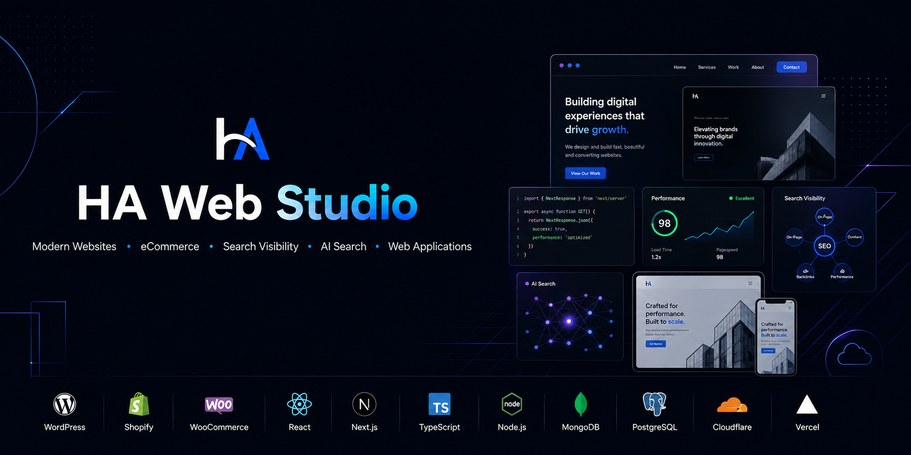

# HA Web Studio

[![Animated typing header for HA Web Studio][typing-image]][typing-link]

We help businesses build, improve, and grow their digital presence through
modern websites, eCommerce systems, search visibility, performance
optimization, and maintainable web applications.

[![Website HA Web Studio][website-badge]][website-link]
[![LinkedIn][linkedin-badge]][linkedin-link]
[![Open source ready][opensource-badge]][github-link]

---

## What We Build

HA Web Studio is a web engineering studio for businesses that need practical,
maintainable, and measurable digital systems. We work across business websites,
eCommerce, landing pages, technical SEO, local search visibility, API
integrations, performance optimization, and custom web applications.

The focus is simple: build websites and systems that are fast, accessible,
search-aware, easy to maintain, and aligned with real business goals.

## Services

| Websites | Commerce | Search & Growth |
| --- | --- | --- |
| Business websites | Shopify development | Technical SEO |
| Website redesigns | WooCommerce builds | Local SEO foundations |
| Landing pages | Checkout and UX improvements | Google Business Profile setup |
| Frontend development | Product and collection pages | AI search visibility and AEO |

| Optimization | Engineering | Maintenance |
| --- | --- | --- |
| Performance audits | Custom web applications | Website maintenance |
| Core Web Vitals improvements | REST and third-party APIs | Migration support |
| Conversion optimization | AI API integrations | Analytics and tracking |
| Website audits | Backend services | Ongoing technical support |

## Technology Stack

[![Technology icons][technology-icons]][technology-link]

| Area | Tools |
| --- | --- |
| CMS | WordPress, WooCommerce |
| Commerce | Shopify, WooCommerce |
| Frontend | HTML, CSS, JavaScript, TypeScript, React, Next.js |
| Backend | Node.js, Express |
| Database | MongoDB, PostgreSQL |
| Deployment | Vercel, Cloudflare |
| Integrations | REST APIs, third-party APIs, AI APIs |

## Currently Building

| Focus | Status |
| --- | --- |
| HA Web Studio website | Ready |
| Knowledge base | Planned |
| Design system and reusable UI | Planned |
| Case study library | Planned |
| AI search visibility resources | Planned |
| Website starter templates | Planned |

## Featured Repositories

| Repository | Purpose | Status |
| --- | --- | --- |
| `website` | Official HA Web Studio website | ![Status: Ready][status-ready] |
| `ui` | Shared interface components and design patterns | ![Status: Planned][status-planned] |
| `templates` | Website and landing page starter templates | ![Status: Planned][status-planned] |
| `docs` | Public documentation and learning resources | ![Status: Planned][status-planned] |
| `tools` | Internal utilities and automation scripts | ![Status: Planned][status-planned] |
| `portfolio` | Portfolio and case study source | ![Status: Planned][status-planned] |

## Roadmap

| Phase | Direction |
| --- | --- |
| Foundation | Publish the main website, brand assets, documentation structure, and public repository standards. |
| Systems | Build reusable UI components, starter templates, and repeatable project workflows. |
| Resources | Publish technical SEO, performance, local search, and AI search visibility guides. |
| Open Source | Release templates, components, checklists, and utilities that are useful beyond client work. |

## Repository Map

| Name | Role |
| --- | --- |
| `website` | Main marketing website |
| `ui` | Shared UI components |
| `templates` | Reusable website templates |
| `docs` | Documentation and public knowledge base |
| `brand-assets` | Logos, banners, social graphics, and identity files |
| `portfolio` | Portfolio and case studies |
| `tools` | Internal scripts, audits, and workflow utilities |
| `boilerplates` | Opinionated project foundations |
| `starter-nextjs` | Next.js starter |
| `starter-wordpress` | WordPress starter |
| `starter-shopify` | Shopify starter |

## Open Source Philosophy

We plan to open source practical resources that make web projects easier to
start, improve, audit, and maintain. The goal is to publish useful components,
templates, checklists, documentation, and workflow tools without pretending that
early-stage projects are more mature than they are.

## Contact

| Channel | Link |
| --- | --- |
| Website | [hawebstudio.com][website-link] |
| LinkedIn | [linkedin.com/company/hawebstudio][linkedin-link] |
| Facebook | [facebook.com/hawebstudiocom][facebook-link] |
| Instagram | [instagram.com/hawebstudio][instagram-link] |
| YouTube | [youtube.com/@hawebstudio][youtube-link] |

---

**Building clear, fast, maintainable web systems for businesses.**

[typing-image]: https://readme-typing-svg.demolab.com?font=Inter&weight=600&size=22&duration=2800&pause=900&color=0969DA&center=true&vCenter=true&width=720&separator=%7C&lines=Modern+business+websites%7CPerformance-focused+eCommerce%7CTechnical+SEO+and+search+visibility%7CCustom+web+applications%7CAI+search+visibility+and+AEO
[typing-link]: https://git.io/typing-svg
[website-badge]: https://img.shields.io/badge/Website-HA%20Web%20Studio-2EA44F?style=flat-square
[website-link]: https://hawebstudio.com
[linkedin-badge]: https://img.shields.io/badge/LinkedIn-HA%20Web%20Studio-0A66C2?style=flat-square&logo=linkedin&logoColor=white
[linkedin-link]: https://linkedin.com/company/hawebstudio
[opensource-badge]: https://img.shields.io/badge/Open%20Source-Ready-2EA44F?style=flat-square&logo=github&logoColor=white
[github-link]: https://github.com/hawebstudio
[technology-icons]: https://skillicons.dev/icons?i=html,css,js,ts,react,nextjs,wordpress,nodejs,express,mongodb,postgres,cloudflare,vercel&theme=light&perline=13
[technology-link]: https://skillicons.dev
[status-ready]: https://img.shields.io/badge/status-ready-2EA44F?style=flat-square
[status-planned]: https://img.shields.io/badge/status-planned-FFA500?style=flat-square
[facebook-link]: https://facebook.com/hawebstudiocom
[instagram-link]: https://instagram.com/hawebstudio
[youtube-link]: https://youtube.com/@hawebstudio
